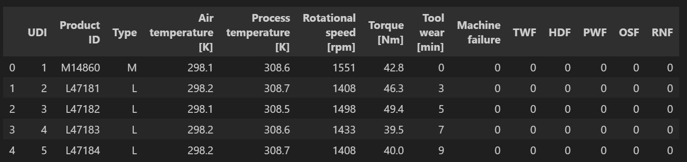
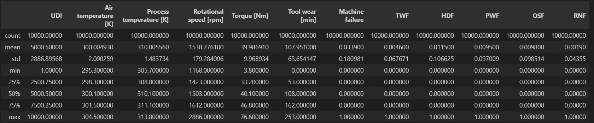
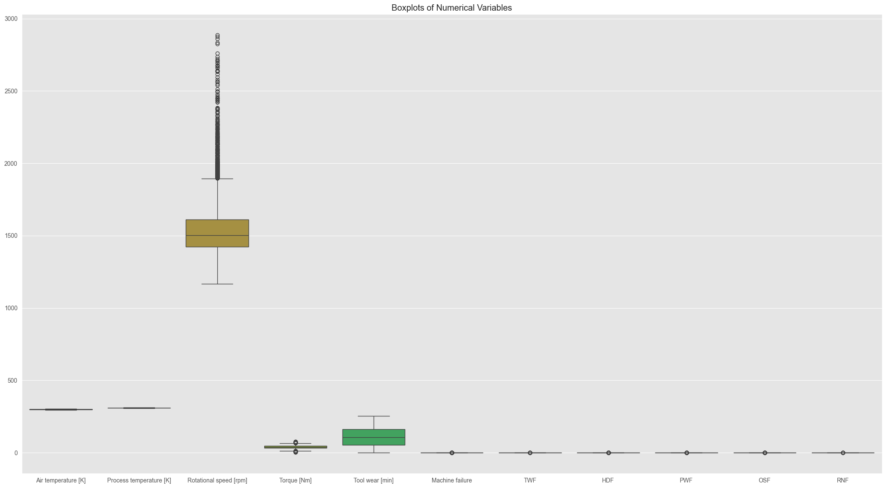
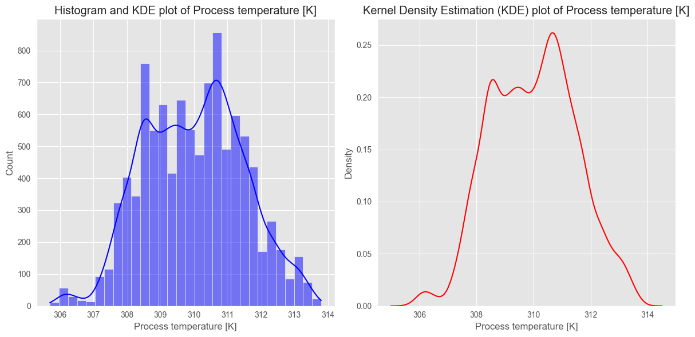
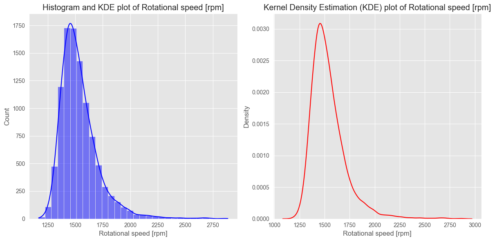
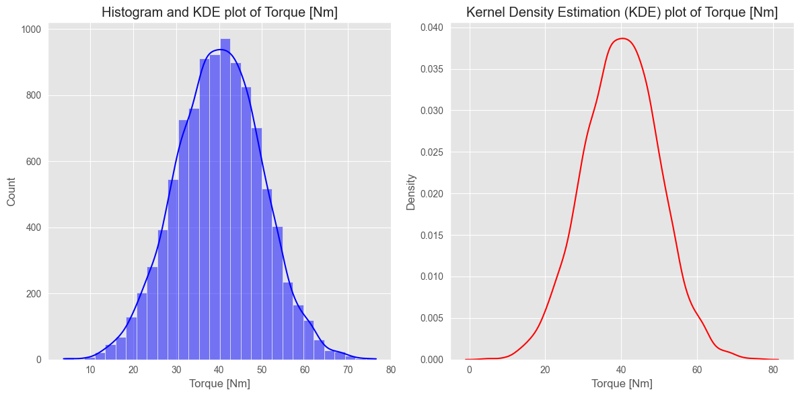
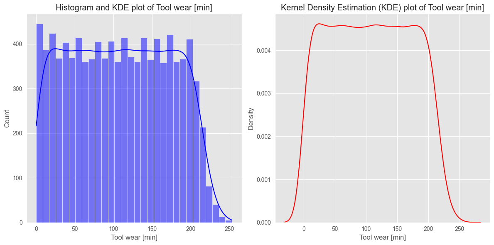
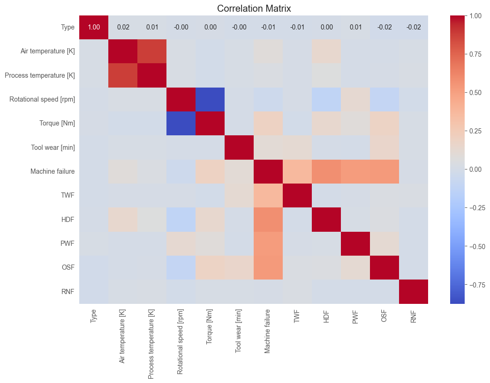
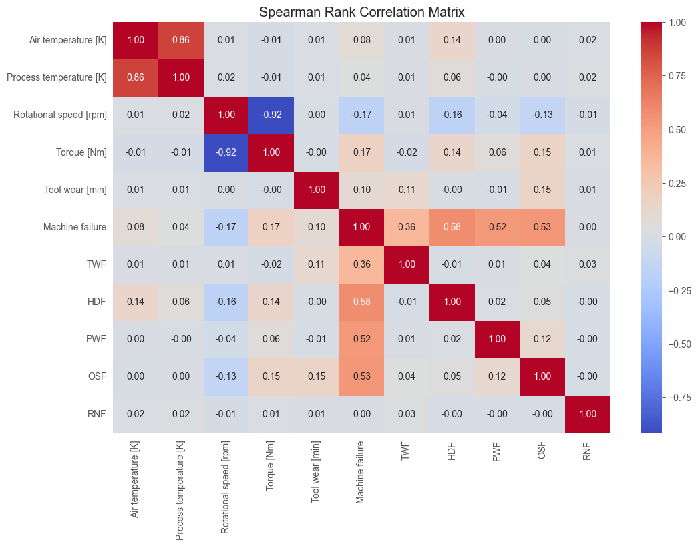

## Overview
Machine failures can lead to significant downtime and maintenance costs.

This project aims to address this issue by building a machine learning model that predicts failures in advance leading to extended equipment lifespan and overcoming the challenges related to machine downtime including Long Maintenance Waiting time & Productivity Decrease

Anticipating machine failures leads to making informed decisions on production planning and resource allocation.
This approach empowers businesses to proactively manage maintenance, minimize downtime, and optimize operational efficiency

## Built with:

 

## Key Features
- Proactive Maintenance: Identify potential machine failures before they occur, allowing for proactive maintenance.
- Operational Efficiency: Optimize production schedules and resource allocation by minimizing unexpected downtime.
- Scalable Model Management: Utilize MLflow for efficient model tracking, versioning, and deployment.
- User-friendly Interface: Easy-to-use scripts for training models, tracking experiments & evaluating results.

## Approach
This project focuses on predicting machine failures using Random Forests, implemented with Scikit-learn.
The Machine Learning Lifecycle was managed with MLflow. 
The goal is to create a robust model that can accurately predict machine failures based on input features representing the states of the componenets of a machine.

### Dataset Overview
<h3 align="center">Dataset Sample relavant for feature overview</h3>

  

<h3 align="center">Summary Statistics allow understanding of features</h3>

  

<h3 align="center">Box Plots allow the choice of an Appropriate Normalization Method</h3>

  

<h3 align="center">Kernel Density - Histogram Estimation</h3>

  
  
  
  

<h3 align="center">Pearson Correlation Analysis to Understand Linear Relationship between features</h3>

  

<h3 align="center">Spearman Correlation Analysis to Understand Non Linear Relationship between features</h3>

  

<h2 align="center">Evaluation: Accuracy of: 0.9937  </h2>

<table align="center">
  <tr>
    <th></th>
    <th>Precision</th>
    <th>Recall</th>
    <th>F1-Score</th>
    <th>Support</th>
  </tr>
  <tr>
    <td>Class 0</td>
    <td>0.9935</td>
    <td>1.0</td>
    <td>0.9967</td>
    <td>2907.0</td>
  </tr>
  <tr>
    <td>Class 1</td>
    <td>1.0</td>
    <td>0.7957</td>
    <td>0.8862</td>
    <td>93.0</td>
  </tr>
  <tr>
    <td>Macro Avg</td>
    <td>0.9968</td>
    <td>0.8978</td>
    <td>0.9415</td>
    <td>3000.0</td>
  </tr>
  <tr>
    <td>Weighted Avg</td>
    <td>0.9937</td>
    <td>0.9937</td>
    <td>0.9933</td>
    <td>3000.0</td>
  </tr>
</table>

## Setup
- Clone the repository & navigate
- Install dependencies
- View Exploratory Data analysis on EDA.ipynb
- Model Training
~~~
python main.py
~~~

## Contact:
Feel free to reach out to me on LinkedIn or through email & don't forget to visit my portfolio.
 
  
  
  

